# Core Class Design - Hanachan v2 (Production Spec)

This document defines the high-level class architecture to support the complex business flows of the Hanachan platform, including the FSRS algorithm, facetted review logic, and curriculum progression rules.

```plantuml
@startuml
skinparam packageStyle rectangle
skinparam classAttributeIconSize 0
hide circle

' ==========================================
' 1. THE BRAIN: FSRSEngine
' ==========================================
class FSRSEngine {
  - stability_weights : Double[]
  - difficulty_weights : Double[]
  + DEFAULT_DIFFICULTY : Double = 3.0
  --
  + calculateNextReview(state: LearningState, rating: Enum) : NextReviewData
  + predictStability(state: LearningState) : Double
  + shouldPromoteToReview(stability: Double) : Boolean
}

' ==========================================
' 2. THE COORDINATOR: ReviewSessionManager
' ==========================================
class ReviewSessionManager {
  - sessionQueue : List<ReviewItem>
  - currentItem : ReviewItem
  - unitProgress : Map<KU_ID, List<FacetState>>
  --
  + loadDueItems(userId: UUID, limit: Integer) : void
  + submitAnswer(userInput: String) : ValidationResult
  + commitItemResult(kuId: UUID) : Boolean -- Only when ALL facets passed
  + handleIncorrect(item: ReviewItem) : void -- Re-queues at the end
}

' ==========================================
' 3. THE CURRICULUM LEAD: LessonBatchManager
' ==========================================
class LessonBatchManager {
  - activeBatch : List<LessonItem>
  - lockedLevel : Integer
  --
  + initializeBatch(userId: UUID) : void
  + validateCompletion() : Boolean -- Enforce viewing all lessons before quiz
  + checkLevelUnlocking(userId: UUID) : Boolean -- The 90% Knowledge Rule
  + autoUnlockNextLevel(userId: UUID) : void
}

' ==========================================
' 4. THE ENTITY: KnowledgeUnit (Rich Domain)
' ==========================================
class KnowledgeUnit {
  + id : UUID
  + type : Enum (RADICAL, KANJI, VOCAB, GRAMMAR)
  + level : Integer
  - attributes : Map<String, Object>
  --
  + getRelationshipMatrix() : List<KnowledgeUnit> -- Radical -> Kanji links
  + getFacets() : List<Enum> -- Meaning, Reading, Cloze
}

' ==========================================
' 5. THE ANALYST: ProgressTracker
' ==========================================
class ProgressTracker {
  --
  + getDailyAccuracy(userId: UUID) : Double
  + getHeatmapData(userId: UUID) : List<DailyCount> -- Grouped by date
  + calculateRetentionRate(userId: UUID) : Double
}

' ==========================================
' 6. THE ASSISTANT: ChatAssistantService
' ==========================================
class ChatAssistantService {
  - vectorStore : IVectorDB
  --
  + processQuery(userId: UUID, query: String) : Stream<Message>
  + extractEntities(text: String) : List<KU_ID>
  + getContextualStudyGuide(kuId: UUID) : String
}

' ==========================================
' 7. THE MOTIVATOR: UserProfileManager
' ==========================================
class UserProfileManager {
  --
  + updateStreak(userId: UUID) : Integer
  + calculateLevelXP(userId: UUID) : Integer
  + syncSettings(preferences: JSON) : void
}

' RELATIONSHIPS
ReviewSessionManager --> FSRSEngine : uses
ReviewSessionManager ..> ProgressTracker : updates logs
LessonBatchManager ..> KnowledgeUnit : filters
ChatAssistantService ..> KnowledgeUnit : links
LessonBatchManager --> UserProfileManager : unlocks levels

@enduml
```

## Detailed Responsibility Breakdown

### 1. `FSRSEngine`
- **Responsibility**: Pure mathematical engine for the Free Spaced Repetition Scheduler.
- **Business Rule**: Uses a `3.0` difficulty baseline. Promotes items from `learning` to `review` grade only when stability reaches **3 days**.
- **Smart Relearning**: Implements "Non-zero Reps" (Reps-2) on fail and a stability penalty of `0.4x`. Includes a stability guard to prevent Success intervals from being shorter than the current state.
- **Hiding Logic**: Items with stability > 120 days are marked as `burned` and filtered from active review queues.

### 2. `ReviewSessionManager` (ReviewSessionController)
- **Responsibility**: Manages the "Active Recall" phase and session-level question state.
- **Business Rule**: Implements **Buffered Persistence**. It holds an item in the local session queue until all facets (e.g., both *Meaning* and *Reading* for Vocabulary) are answered correctly. 
- **Persistence Rule**: SRS calculations (FSRS updates) only occur at the moment an item successfully leaves the session. If an item was failed at any point during the session, it is committed with a penalty rating ('fail') to correctly update memory stability.

### 3. `LessonBatchManager`
- **Responsibility**: Manages the **Sequential Learning** path.
- **Business Rule**: Enforces the **90% Knowledge Rule**. It queries the `UserLearningState` to check if 90% of the current level's content has moved to the `review` stage before incrementing the `max_unlocked_level`.

### 4. `KnowledgeUnit`
- **Responsibility**: Domain model representing a single point of knowledge.
- **Role**: Encapsulates the hierarchy (e.g., a Kanji object can return its constituent Radicals) and defines which facets need testing (Meaning, Reading, or Cloze).

### 5. `ProgressTracker`
- **Responsibility**: Real-time analytics engine.
- **Role**: Aggregates `LearningLog` data to generate the activity heatmap and calculate the user's precision/retention rates for the Dashboard.

### 6. `ChatAssistantService`
- **Responsibility**: Intelligent retrieval and explanation.
- **Role**: Combines LLM capabilities with the local knowledge base. It uses entity extraction to link chat messages to specific `KnowledgeUnit` Detail pages via CTA buttons.

### 7. `UserProfileManager`
- **Responsibility**: Gamification and user meta-data.
- **Role**: Tracks the Daily Streak (🔥) and calculates Level advancement based on currency and XP logic (Progress Domain).
