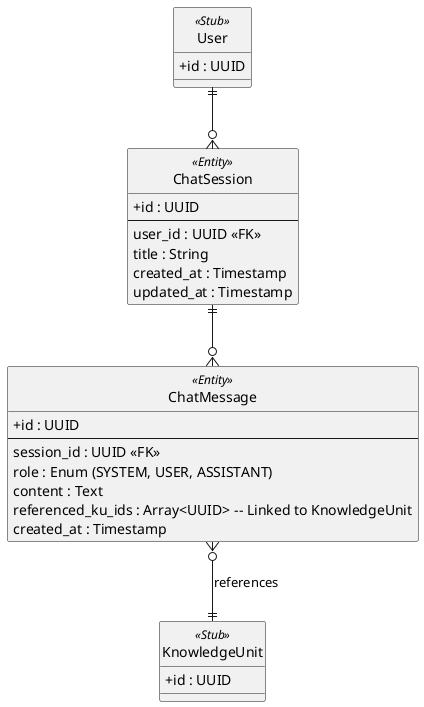

# Assistant Domain ER Diagram

## Key Architectural Decisions

1. **Array-based Referencing**: For technical simplicity and performance (Supabase/PostgreSQL), referenced Knowledge Units are stored as a UUID array directly on the `ChatMessage`. This allows the AI to "tag" relevant topics in its response.
2. **Session Persistence**: Storing chat in `ChatSession` allows a user to have multiple threads (e.g., "Grammar help", "Analysis of a news article") without mixing contexts.
3. **Role-based Messages**: Standard `role` field ensures compatibility with common LLM message formats (OpenAI/Anthropic).
