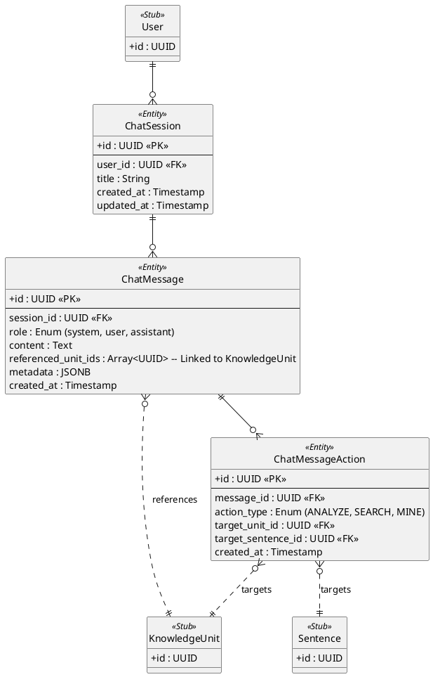

# Assistant Domain ER Diagram

This diagram outlines the structures supporting the Hanachan AI Chatbot, focusing on session management, persistent entity linking, and action logging.

## Key Architectural Decisions

1. **Explicit Action Logging**: Interactions performed via AI tools (like sentence analysis or database searching) are explicitly logged in `ChatMessageAction`. This allows for tracking which specific entities (Units or Sentences) were the focus of an AI response.

2. **Array-based Entity Referencing**: For technical simplicity and performance, referenced Knowledge Units are stored as a UUID array (`referenced_unit_ids`) directly on the `ChatMessage`. This allows the UI to quickly render interactive "CTA" buttons for units mentioned in the text.

3. **Threaded Session Management**: Storing chat in `ChatSession` allows users to maintain isolated conversation threads, keeping retrieval contexts clean for the RAG (Retrieval-Augmented Generation) system.

4. **Rich Metadata**: The `metadata` field on `ChatMessage` stores tool execution details, reasoning traces, or other non-visible data that might be useful for debugging or advanced UI features.
