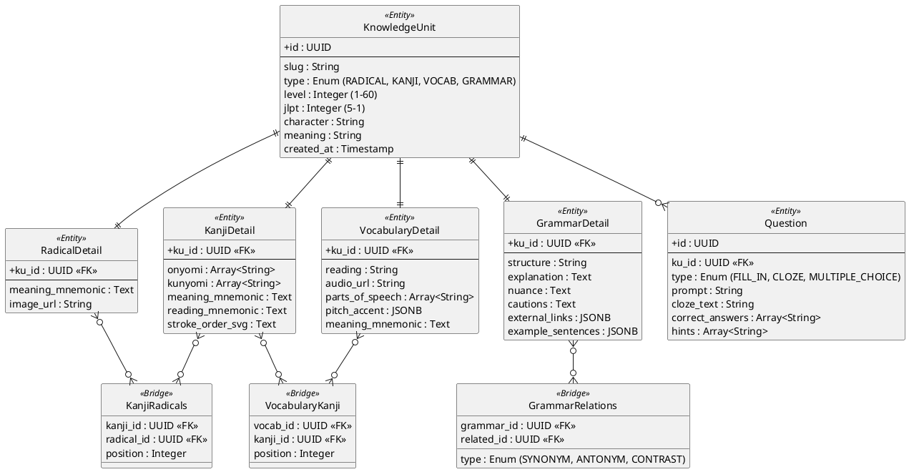

# Content Domain ER Diagram

## Key Architectural Decisions

1. **Table-per-Type Inheritance**: `KnowledgeUnit` acts as the base class for all learning materials. This allows for a unified `UserLearningState` (SRS) regardless of whether it's a Kanji or a Grammar point.
2. **Deep Cross-Referencing**:
   - **Kanji-Radical**: Allows users to see every component of a Kanji.
   - **Vocab-Kanji**: Allows users to jump from a word to the Kanji detail page to learn individual components.
   - **Grammar Similarity**: Helps users differentiate between confusingly similar grammar points (Bunpro style).
3. **Multi-Cloze Questions**: The `correct_answers` and `hints` are arrays, enabling questions with multiple blank spots in a single sentence.
