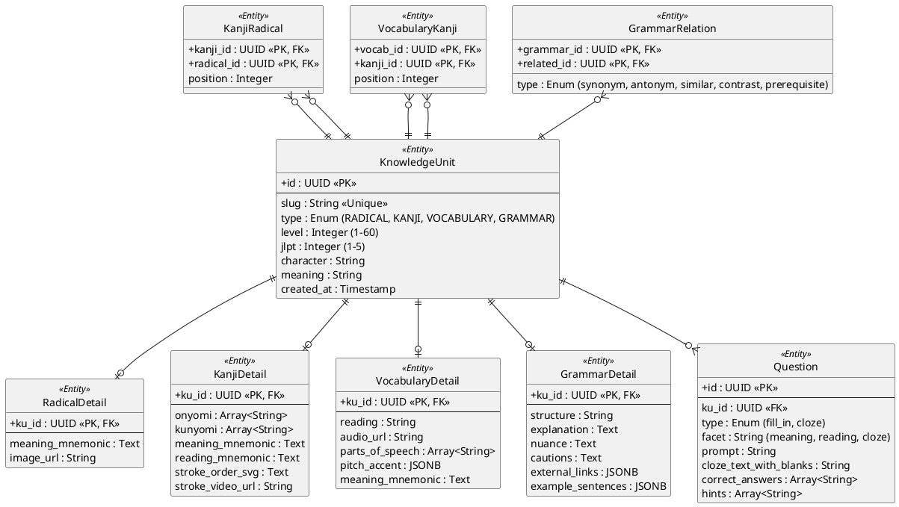

# Content Domain ER Diagram

This diagram focuses on the static knowledge base of the Hanachan platform, including the hierarchical relationships between radicals, kanji, and vocabulary.

## Key Architectural Decisions

1. **Table-per-Type Inheritance**: `KnowledgeUnit` acts as the base class for all learning materials. This allows for a unified `UserLearningState` (SRS) regardless of whether it's a Kanji or a Grammar point. Type-specific extensions are handled via 1:1 detail tables.

2. **Deep Cross-Referencing**:
   - **Kanji-Radical**: Essential for building mnemonics and understanding Kanji structure.
   - **Vocab-Kanji**: Enables the "Discovery" flow where users can explore Kanji components directly from a word.
   - **Grammar Similarity**: Supports the `grammar_relations` table to help users differentiate between confusingly similar particles or structures.

3. **Multi-Facet Questioning**: A single `KnowledgeUnit` can have multiple `Questions` linked to different facets (Meaning, Reading, or Cloze). This supports the **Independence Law** where facets are tracked separately.

4. **Rich Metadata Storage**: Use of `JSONB` for fields like `example_sentences` and `external_links` allows for flexible, schema-less expansion of content-rich details without complex joins.
