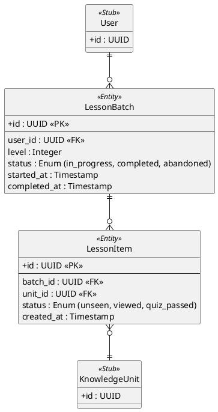

# Discovery (Learning) Session Domain ER Diagram

This diagram describes the persistent states during the **Discovery Phase** (learning new material for the first time).

## Key Architectural Decisions

1. **Transactional Lesson Batches**: A `LessonBatch` represents a fixed discovery set (e.g., 5 items). The system tracks the complete lifecycle of this batch.

2. **Granular Resume Capability**: The status of individual items (`unseen`, `viewed`, `quiz_passed`) is tracked in `LessonItem`. This allows users to drop off at any point (e.g., in the middle of a slideshow) and resume exactly where they left off without losing progress.

3. **Strict DB-Driven Onboarding**: Note that this diagram **does not** touch the `UserLearningState` tables directly. The connection to the long-term memory system (SRS) happens only *after* a `LessonItem` reaches the `quiz_passed` status. All questions used for the quiz are loaded from the `Question` table (No Gen Quiz policy).
