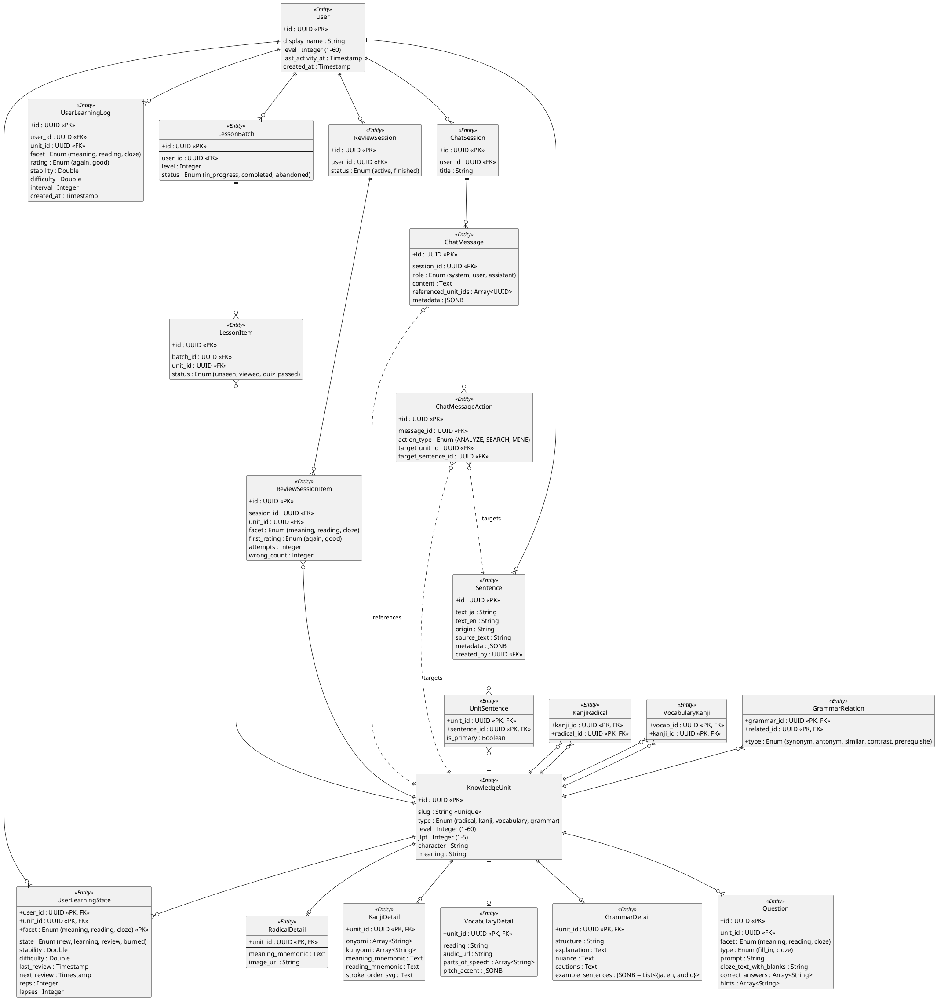

# Master System ER Diagram - Hanachan v2

This diagram provides a birds-eye view of the entire system, consolidating the User, Content, Session, and Assistant domains.

## Key Architectural Decisions

1. **Normalized Content Details**: To support diverse Knowledge Unit (Unit) types while maintaining a unified interface, core metadata is stored in `KnowledgeUnit`, while type-specific data resides in extension tables (`KanjiDetail`, etc.). This ensures efficient filtering and browsing across all content types.

2. **Transactional Lessons vs. Atomic Reviews (DB-Driven)**:
   - **Lessons**: Structured as batches. All quiz phases use questions fetched from the `Question` table (No Gen Quiz policy).
   - **Reviews**: Items are independent but use the **FIF (Failure Intensity Framework)**. Incorrect answers are tracked (Drill mode) and a correct answer triggers a single FSRS update with a weighted penalty. This ensures stability is only updated once per session per card, avoiding ease hell.

3. **FSRS Independence Law**: Progression is tracked per **facet** (e.g., you might know a word's meaning but not its reading). Each facet has its own record in `UserLearningState`, allowing for granular recall optimization.

4. **Circular Knowledge Graph**: The system implements explicit cross-referencing (e.g., `VocabularyKanji`, `KanjiRadical`). This allows the UI and the AI Chatbot to traverse the knowledge graph, providing context like "What radicals make up this Kanji?" or "What vocabulary uses this character?".

5. **Analytical Logging**: Every review event is logged in `UserLearningLog`. This provides the raw data necessary for generating heatmaps, retention curves, and precision statistics on the user's dashboard.
