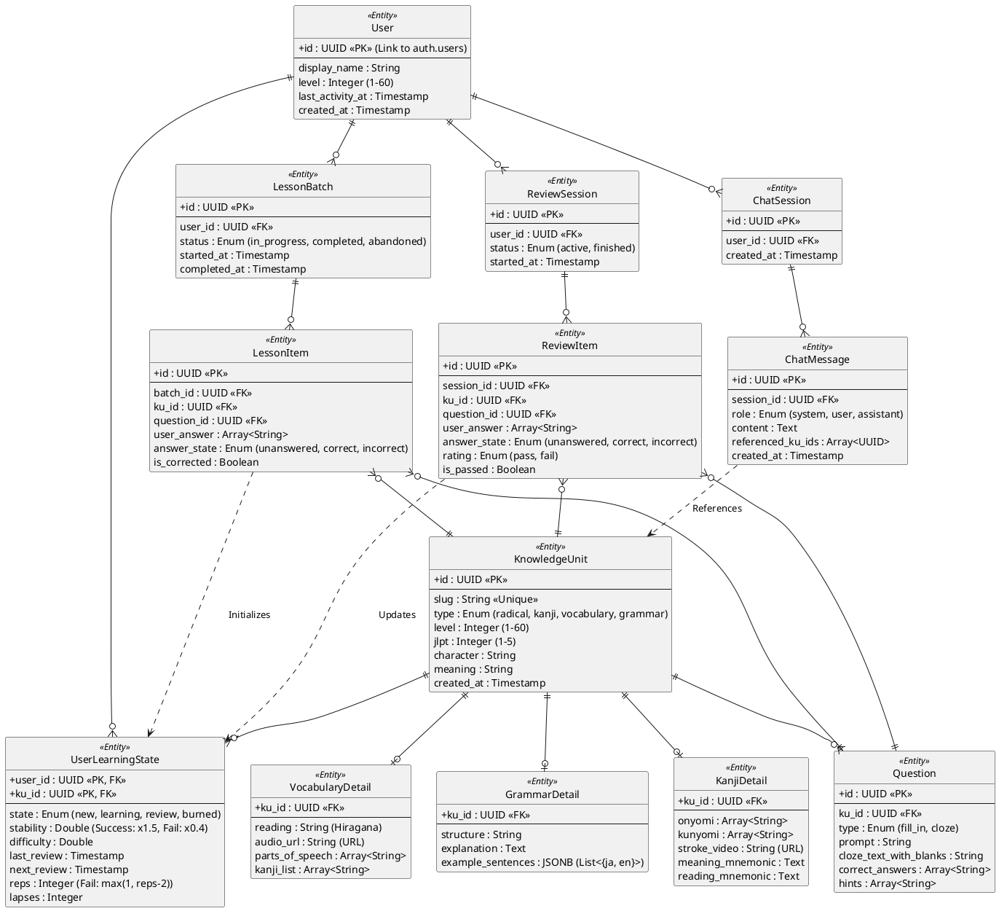

# Master System ER Diagram - Hanachan v2

```plantuml
@startuml
skinparam packageStyle rectangle
skinparam classAttributeIconSize 0
hide circle

' ==========================================
' 1. USER DOMAIN
' ==========================================
class User <<Entity>> {
  + id : UUID <<PK>> (Link to auth.users)
  --
  display_name : String
  level : Integer (1-60)
  last_activity_at : Timestamp
  created_at : Timestamp
}

' ==========================================
' 2. CONTENT DOMAIN
' ==========================================
class KnowledgeUnit <<Entity>> {
  + id : UUID <<PK>>
  --
  slug : String <<Unique>>
  type : Enum (radical, kanji, vocabulary, grammar)
  level : Integer (1-60)
  jlpt : Integer (1-5)
  character : String
  meaning : String
  created_at : Timestamp
}

class KanjiDetail <<Entity>> {
  + ku_id : UUID <<FK>>
  --
  onyomi : Array<String>
  kunyomi : Array<String>
  stroke_video : String (URL)
  meaning_mnemonic : Text
  reading_mnemonic : Text
}

class VocabularyDetail <<Entity>> {
  + ku_id : UUID <<FK>>
  --
  reading : String (Hiragana)
  audio_url : String (URL)
  parts_of_speech : Array<String>
  kanji_list : Array<String>
}

class GrammarDetail <<Entity>> {
  + ku_id : UUID <<FK>>
  --
  structure : String
  explanation : Text
  example_sentences : JSONB (List<{ja, en}>)
}

' ==========================================
' 3. QUESTION DOMAIN
' ==========================================
class Question <<Entity>> {
  + id : UUID <<PK>>
  --
  ku_id : UUID <<FK>>
  type : Enum (fill_in, cloze)
  prompt : String
  cloze_text_with_blanks : String
  correct_answers : Array<String>
  hints : Array<String>
}

' ==========================================
' 4. SESSION DOMAIN
' ==========================================
class LessonBatch <<Entity>> {
  + id : UUID <<PK>>
  --
  user_id : UUID <<FK>>
  status : Enum (in_progress, completed, abandoned)
  started_at : Timestamp
  completed_at : Timestamp
}

class LessonItem <<Entity>> {
  + id : UUID <<PK>>
  --
  batch_id : UUID <<FK>>
  ku_id : UUID <<FK>>
  question_id : UUID <<FK>>
  user_answer : Array<String>
  answer_state : Enum (unanswered, correct, incorrect)
  is_corrected : Boolean
}

class ReviewSession <<Entity>> {
  + id : UUID <<PK>>
  --
  user_id : UUID <<FK>>
  status : Enum (active, finished)
  started_at : Timestamp
}

class ReviewItem <<Entity>> {
  + id : UUID <<PK>>
  --
  session_id : UUID <<FK>>
  ku_id : UUID <<FK>>
  question_id : UUID <<FK>>
  user_answer : Array<String>
  answer_state : Enum (unanswered, correct, incorrect)
  rating : Enum (pass, fail)
  is_passed : Boolean
}

' ==========================================
' 5. PROGRESS (FSRS STATE)
' ==========================================
class UserLearningState <<Entity>> {
  + user_id : UUID <<PK, FK>>
  + ku_id : UUID <<PK, FK>>
  --
  state : Enum (new, learning, review, burned)
  stability : Double (Success: x1.5, Fail: x0.4)
  difficulty : Double
  last_review : Timestamp
  next_review : Timestamp
  reps : Integer (Fail: max(1, reps-2))
  lapses : Integer
}

' ==========================================
' 6. ASSISTANT DOMAIN
' ==========================================
class ChatSession <<Entity>> {
  + id : UUID <<PK>>
  --
  user_id : UUID <<FK>>
  created_at : Timestamp
}

class ChatMessage <<Entity>> {
  + id : UUID <<PK>>
  --
  session_id : UUID <<FK>>
  role : Enum (system, user, assistant)
  content : Text
  referenced_ku_ids : Array<UUID>
  created_at : Timestamp
}

' ==========================================
' RELATIONSHIPS
' ==========================================

' Content details
KnowledgeUnit ||--o| KanjiDetail
KnowledgeUnit ||--o| VocabularyDetail
KnowledgeUnit ||--o| GrammarDetail
KnowledgeUnit ||--o{ Question

' Progress State
User ||--o{ UserLearningState
KnowledgeUnit ||--o{ UserLearningState

' Sessions
User ||--o{ LessonBatch
User ||--o{ ReviewSession
LessonBatch ||--o{ LessonItem
ReviewSession ||--o{ ReviewItem

' Session-Content-Question links
LessonItem }o--|| KnowledgeUnit
LessonItem }o--|| Question
ReviewItem }o--|| KnowledgeUnit
ReviewItem }o--|| Question

' Assistant
User ||--o{ ChatSession
ChatSession ||--o{ ChatMessage

' Cross-domain data flow (Logical)
ReviewItem ..> UserLearningState : "Updates"
LessonItem ..> UserLearningState : "Initializes"
ChatMessage ..> KnowledgeUnit : "References"

@enduml
```
