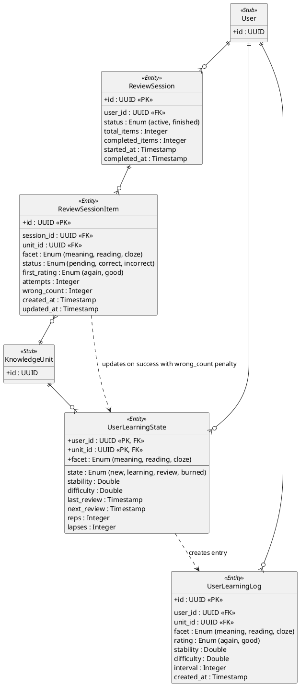

# Review Session Domain ER Diagram

This diagram describes the tracking logic for **Spaced Repetition Reviews**, including session history and FSRS state updates.

## Key Architectural Decisions

1. **FIF Architecture (Failure Intensity Framework)**: Review items are processed in a "Drill then Commit" flow. Incorrect answers increment `wrong_count` without updating FSRS. A correct answer triggers a **single** FSRS update, applying a logarithmic penalty based on `wrong_count`. This prevents "Ease Hell" while accurately reflecting recall effort.

2. **No Gen Quiz Policy**: The system does not generate questions on the fly. This ensures that every question shown to the user (whether for meaning, reading, or grammar) has been explicitly defined or curated in the `Question` table.

3. **Facet Independence**: SRS is calculated per-facet (Meaning, Reading, Cloze), where each facet maps to a specific `Question` type linked to a `KnowledgeUnit`.
