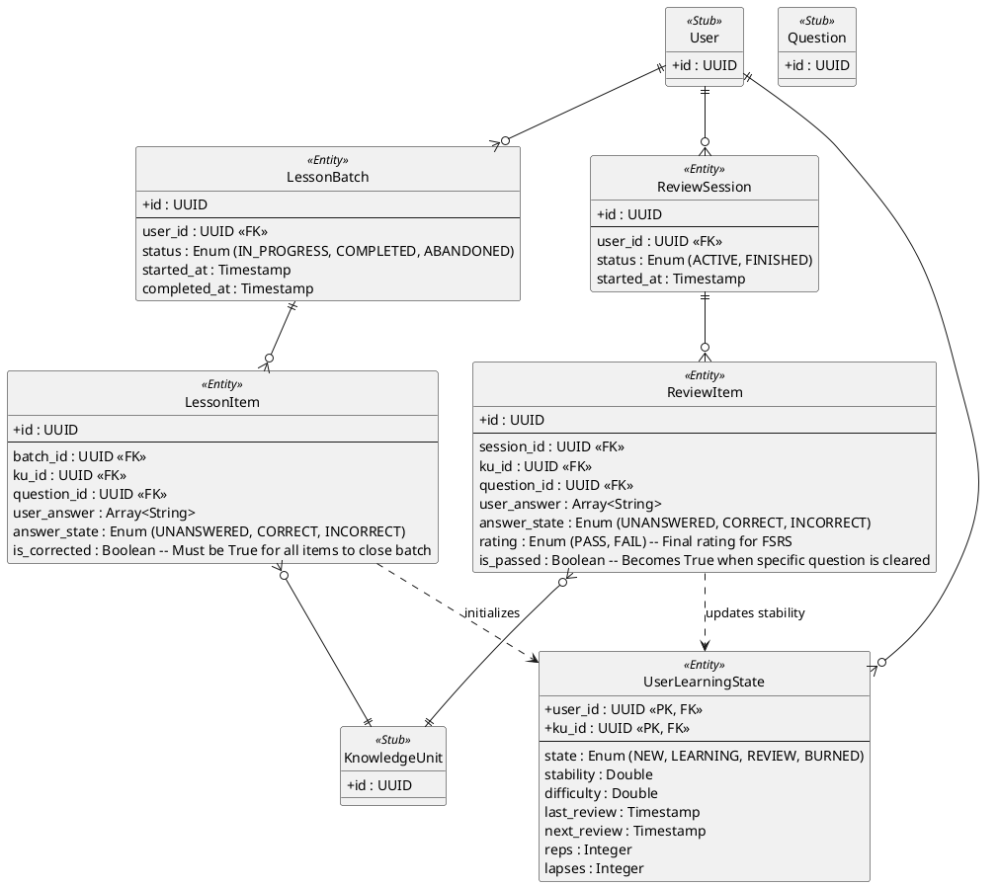

# Session Domain ER Diagram

## Key Architectural Decisions

1. **Lesson Batch Logic**: A `LessonBatch` represents a fixed "Discovery" set. The session cannot be `COMPLETED` until every `LessonItem` has `is_corrected = True`. This ensures the user has at least identified the correct answer for every new item once.
2. **Review Session Logic (Item Clearing)**: A Review Session is more dynamic. A single `KnowledgeUnit` (e.g., a Vocabulary word) might generate two `ReviewItem` entries (one for Reading, one for Meaning). 
   - Once `is_passed = True` for both, the word is removed from the active review queue and the `rating` is sent to the FSRS engine.
3. **Session Interruption**: If a user leaves an active session, the progress is saved. When they return, only items where `is_corrected` or `is_passed` is `False` will be shown.
