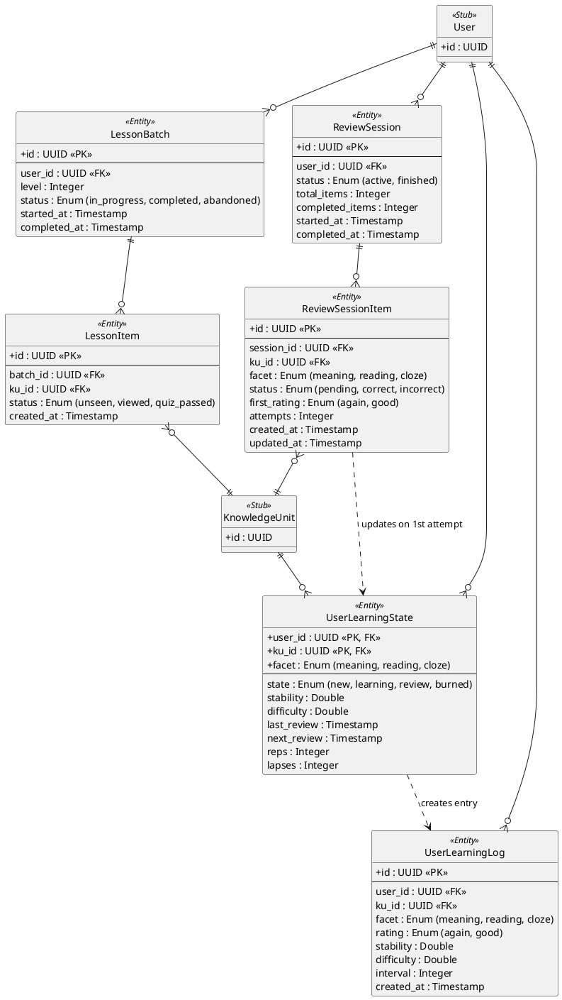

# Session Domain ER Diagram

This diagram describes the temporary and persistent states during learning and review sessions, as well as the long-term FSRS tracking logic.

## Key Architectural Decisions

1. **Transactional Lesson Batches**: A `LessonBatch` represents a fixed discovery set. The status of individual items (`unseen`, `viewed`, `passed`) is tracked to allow users to pause and resume their learning progress perfectly.

2. **Atomic Review Sessions**: Review items are processed independently. Every correct answer triggers an **immediate** FSRS update. The `ReviewSession` and `ReviewSessionItem` tables are used for historical tracking and live progress calculation within the UI session.

3. **Facet Independence**: SRS is calculated per-facet (Meaning, Reading, Cloze). This ensures that forgetting a word's reading doesn't unnecessarily reset the progress of knowing its meaning.

4. **Analytical Integrity**: Every interaction that affects an SRS state is recorded in `UserLearningLog`. This provides a complete audit trail of the user's learning history, used for calculating high-level metrics like accuracy and retention rates.

5. **No Reveal UX Rule**: In both reviews and lesson quizzes, an incorrect answer does not reveal the solution. Instead, the item is re-queued for another attempt later in the session, while the FSRS state is updated immediately based on the initial failure.
