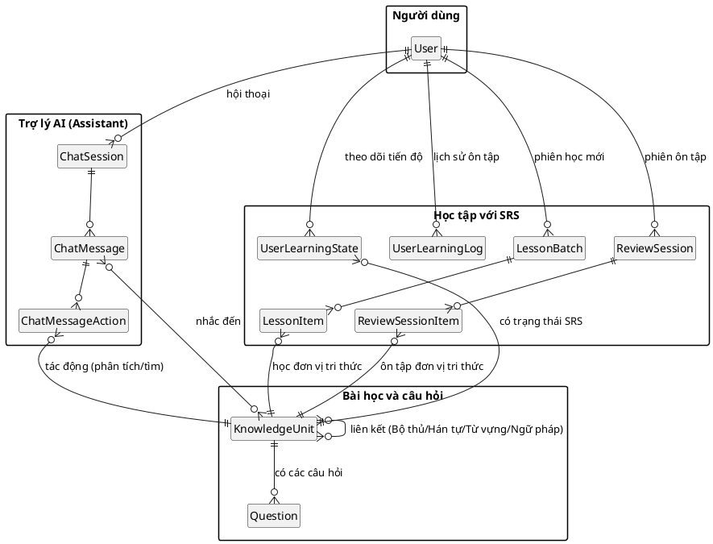

# Sơ đồ ER Hệ thống Rút gọn

Sơ đồ này cung cấp cái nhìn tổng quan về các thực thể và mối quan hệ trong hệ thống, lược bỏ các trường dữ liệu và bảng phụ kỹ thuật để tập trung vào logic cốt lõi.

## Tóm tắt các mối quan hệ

### Các miền (Domains) chính
- **User**: Chủ thể trung tâm kết nối với mọi tiến trình, phiên học và nội dung được tạo ra.
- **KnowledgeUnit**: Đối tượng học tập chính. Mọi hoạt động học tập, câu hỏi và ví dụ đều xoay quanh thực thể này.

### Luồng học tập
- **LessonBatch & LessonItem**: Theo dõi việc khám phá các đơn vị tri thức mới.
- **ReviewSession & ReviewSessionItem**: Theo dõi các nỗ lực ôn tập độc lập cho từng đơn vị.
- **UserLearningState (SRS)**: Trạng thái trí nhớ bền vững cho từng mặt (facet) của bài học.
- **UserLearningLog**: Hồ sơ lịch sử của mọi tương tác SRS (phục vụ thống kê/heatmaps).

- **ChatMessageAction**: Các hành động cụ thể do AI thực hiện (phân tích ngữ pháp, tìm kiếm) lên các thực thể bài học.
