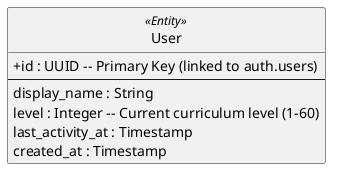

# User Domain ER Diagram

## Key Architectural Decisions

1. **Curriculum Progression Tracking**: The `level` field represents the user's progress through the 60-level curriculum. It is used as a "gate" to unlock new content batches.
2. **No Separate Settings Table**: UI preferences are now managed at the application layer with sensible defaults. The `user_settings` table has been removed to simplify the schema.
3. **Internal Activity Tracking**: `last_activity_at` is used to determine if the user has been active today for statistics.
