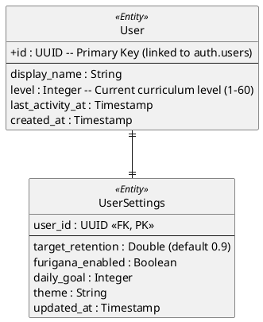

# User Domain ER Diagram

## Key Architectural Decisions

1. **Curriculum Progression Tracking**: The `level` field represents the user's progress through the 60-level curriculum. It is used as a "gate" to unlock new content batches.
2. **Settings Decoupling**: Storing UI preferences (like Furigana visibility or theme) in a separate `UserSettings` table keeps the core `User` table clean and scalable.
3. **Internal Activity Tracking**: `last_activity_at` is used to determine if the user has been active today for statistics, but no explicit "streak" or "XP" is maintained.
