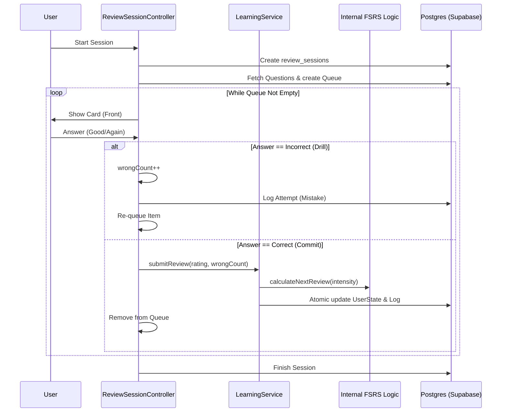

## Minh họa đơn giản (Simplified Flow)

Biểu đồ này đã được điều chỉnh theo kiến trúc **FIF (Failure Intensity Framework)**:
1.  **Trả lời SAI**: Hệ thống chỉ ghi nhận số lần sai (`wrongCount`), không cập nhật FSRS, và bắt học lại ngay (Drill).
2.  **Trả lời ĐÚNG**: Hệ thống tổng hợp số lần sai để tính "Cường độ quên" (Failure Intensity) -> Cập nhật FSRS 1 lần duy nhất khi thẻ bị loại khỏi hàng đợi (Commit).

```mermaid
graph TD
    Start([Bắt đầu Session]) --> PickCard[Lấy 1 thẻ từ hàng đợi]
    
    PickCard --> Ask[Hiển thị câu hỏi]
    Ask --> Answer[Người dùng trả lời]
    
    Answer --> CheckResult{Đúng hay Sai?}
    
    CheckResult -- "Sai (Again)" --> Drill[❌ Lưu: WrongCount++]
    Drill --> Requeue[Đẩy về cuối hàng đợi]
    Requeue --> NextCheck
    
    CheckResult -- "Đúng (Good)" --> Calc[✅ Tính toán: Intensity = log2(Wrong + 1)]
    Calc --> UpdateFSRS[Cập nhật FSRS (1 lần duy nhất)]
    UpdateFSRS --> RemoveCard[Loại khỏi hàng đợi]
    
    RemoveCard --> NextCheck{Còn thẻ không?}
    
    NextCheck -- "Còn" --> PickCard
    NextCheck -- "Hết" --> End([Hoàn thành Session])
```

---

## 3. The Review Loop (Core Logic - FIF)

The controller maintains an in-memory `queue` of `QuizItem` objects and a session state map to track attempts.

### 3.1 Item Presentation
*   The system presents the **Front** of the card (Prompt).
*   The user interacts (types answer) and submits.

### 3.2 Submission & FIF Logic
**Method**: `ReviewSessionController.submitAnswer(rating)`

This method implements the **Failure Intensity Framework (FIF)** which decouples "Drilling" from "FSRS Updating".

#### Path A: The Incorrect Loop (Drill Mode)
If the user answers incorrectly:
1.  **Tracking**: The system increments `wrongCount` in the session state.
2.  **Persistence**: The attempt is logged to DB (`review_session_items` marked as 'incorrect') for analytics, but **NO FSRS update occurs**.
3.  **Requeue**: The item is pushed to the back of the queue.

#### Path B: The Correct Loop (Commit Mode)
If the user answers correctly:
1.  **Intensity Calculation**:
    *   The system retrieves the accumulated `wrongCount` (e.g., 0, 1, 3...).
    *   Calculates `Failure Intensity = min(log2(wrongCount + 1), 3.0)`.
2.  **FSRS Sync (One-Shot)**:
    *   Calls `LearningService.submitReview(..., wrongCount)`.
    *   FSRS Engine applies the penalty: `S_new = S * exp(-0.3 * Intensity)`.
3.  **Finalization**:
    *   The item is removed from the queue.
    *   Session progress increments.

### Why this is better?
*   **No Ease Hell**: Multiple failures in 2 minutes don't destroy your long-term stability exponentially.
*   **Nuance**: Failing 5 times hurts more than failing 1 time, but not 5 times as much.

---

## 4. Session Completion

When the internal queue is empty:

1.  **State Finalization**:
    *   `srsRepository.finishReviewSession(sessionId)` is called.
    *   The session status updates to `finished`.
    *   `completed_at` timestamp is set.

2.  **Dashboard Update**:
    *   The user is redirected to the Summary screen or Dashboard.
    *   Dashboard stats (e.g., "Reviews Due") are refreshed, reflecting the reduced count.

## 5. Data Flow Diagram


