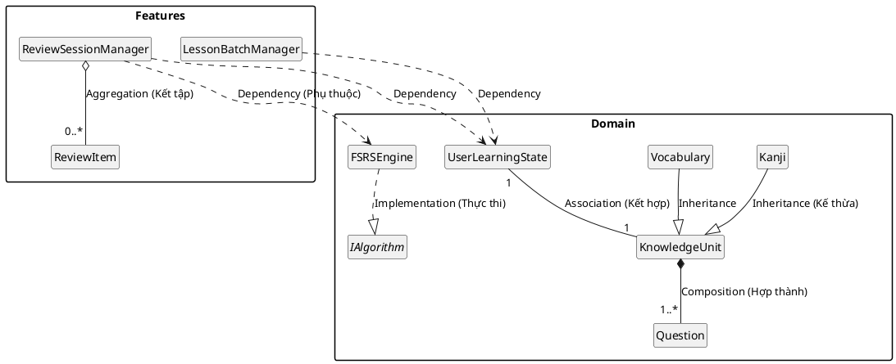

# Thiết kế chi tiết các gói (Detailed Package Design)

Biểu đồ dưới đây mô tả cấu trúc lớp bên trong các gói chính và mối quan hệ giữa chúng, tuân thủ các quy tắc thiết kế hướng đối tượng.

### Giải thích thiết kế:

1.  **Kế thừa (Inheritance)**: `Kanji` và `Vocabulary` kế thừa từ `KnowledgeUnit`. Điều này giúp thống nhất cách quản lý mọi đơn vị tri thức trong hệ thống nhưng vẫn cho phép mở rộng thuộc tính riêng cho từng loại.
   
2.  **Hợp thành (Composition)**: `KnowledgeUnit` chứa các `Question`. Một câu hỏi không thể tồn tại độc lập nếu không có kiến thức gốc. Khi xóa một đơn vị tri thức, các câu hỏi liên quan sẽ bị hủy bỏ hoàn đầu.

3.  **Kết tập (Aggregation)**: `ReviewSessionManager` kết tập các `ReviewItem`. Các mục ôn tập có thể tồn tại tạm thời trong một phiên, nhưng chúng không thuộc quyền sở hữu vĩnh viễn của Manager (có thể được chuyển hàng chờ hoặc lưu trữ lại).

4.  **Thực thi (Implementation)**: `FSRSEngine` thực thi interface `IAlgorithm`. Thiết kế này cho phép hệ thống dễ dàng thay đổi thuật toán ôn tập (ví dụ từ FSRS sang Anki-style) trong tương lai mà không ảnh hưởng đến các lớp gọi nó.

5.  **Phụ thuộc (Dependency)**: Các lớp quản lý ở tầng Features (`ReviewSessionManager`, `LessonBatchManager`) phụ thuộc vào các thực thể lõi ở tầng Domain để thực hiện nghiệp vụ. Điều này tuân thủ nguyên tắc tầng trên sử dụng dịch vụ của tầng dưới.
