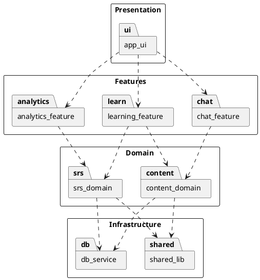

# Biểu đồ phụ thuộc gói (Package Dependency Diagram)

### Giải thích các quy tắc thiết kế áp dụng:
1.  **Phân tầng rõ ràng**: Các gói được đặt trong các Layer từ 1 đến 4.
2.  **Phụ thuộc một chiều (Top-down)**: Tầng trên sử dụng dịch vụ của tầng ngay bên dưới nó. Ví dụ: `app_ui` gọi `features`.
3.  **Không nhảy tầng**: Giao diện (`ui`) không gọi trực tiếp xuống hạ tầng (`db`) mà phải đi qua các tầng trung gian.
4.  **Không phụ thuộc vòng/ngang**: Các gói trong cùng một tầng (như `learning_feature` và `chat_feature`) hoạt động độc lập, không phụ thuộc lẫn nhau để đảm bảo tính module hóa cao.
