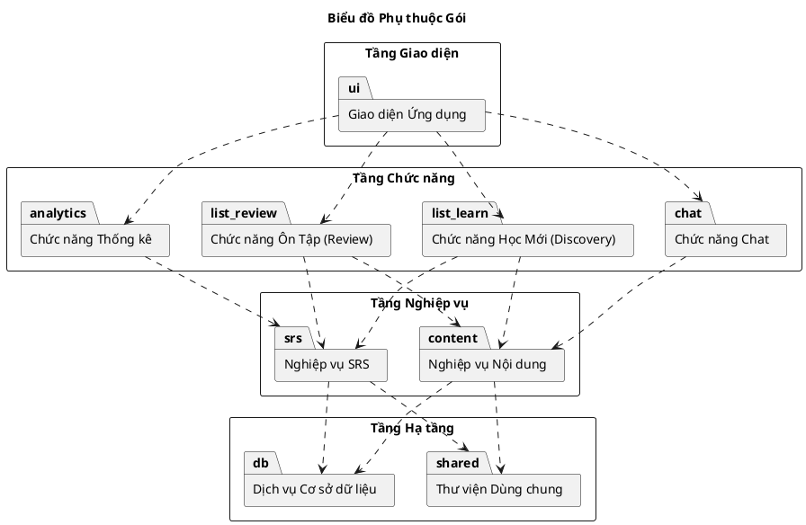

# Biểu đồ Phụ thuộc Gói (Package Dependency Diagram)

### Giải thích các quy tắc thiết kế áp dụng:

1.  **Phân tầng rõ ràng**: Các gói được tổ chức thành 4 tầng riêng biệt từ Giao diện xuống Hạ tầng.
2.  **Phụ thuộc một chiều**: Tầng trên sử dụng dịch vụ của tầng ngay bên dưới nó. Ví dụ: Tầng Giao diện gọi xuống Tầng Chức năng.
3.  **Không nhảy tầng**: Giao diện ứng dụng không được phép gọi trực tiếp xuống các dịch vụ Hạ tầng mà phải đi qua các lớp nghiệp vụ và chức năng trung gian.
4.  **Không phụ thuộc vòng hoặc phụ thuộc ngang**: Các gói trong cùng một tầng hoạt động độc lập, không phụ thuộc lẫn nhau để đảm bảo tính module hóa cao và dễ dàng bảo trì.
