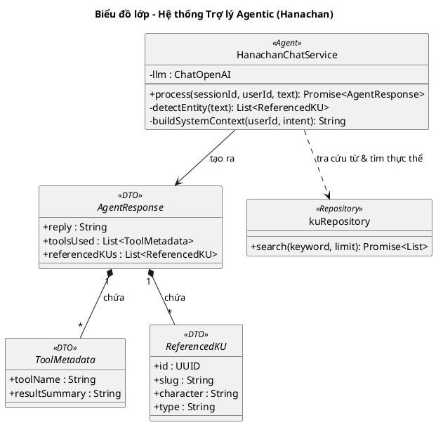

# Biểu đồ lớp: Trợ lý học tập (Hanachan - Agentic)

Biểu đồ này mô tả hệ thống Trợ lý Hanachan dưới dạng một **Simple Agent**, tự động quyết định việc sử dụng công cụ (Tool Call) dựa trên ngữ cảnh thay vì phân loại ý định (Intent) cứng nhắc.

### Đặc điểm thiết kế Agentic:
1.  **Tool-Decided Behavior**: Hanachan sử dụng LLM để quyết định có gọi công cụ tra cứu hay không tùy thuộc vào câu hỏi.
2.  **Universal Entity Detection**: Mọi phản hồi đều được chạy qua bước `detectEntity` để tự động nhận diện và đính kèm `ReferencedKU` (Knowledge Units), phục vụ việc học tập trực tiếp từ nội dung.
3.  **Flexible Response**: `AgentResponse` mang theo danh sách các `toolsUsed`. Giao diện (Frontend) sẽ dựa vào danh sách này để render các UI component tương ứng (ví dụ: render bảng tra cứu từ vựng).
