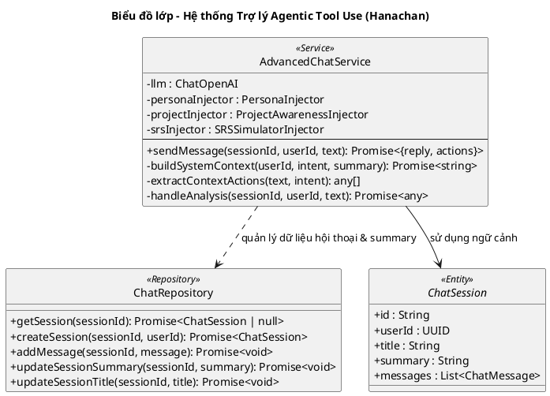

# Biểu đồ lớp: Trợ lý học tập (Hanachan - Agentic Tool Use)

Biểu đồ này mô tả hệ thống Trợ lý Hanachan dưới dạng một **Agentic Model**, sử dụng khả năng suy luận của LLM để tự quyết định việc sử dụng công cụ (Tool Use) và cung cấp phản hồi có ý thức về giáo trình (Curriculum Awareness).

### Nguyên tắc Quản lý Ngữ cảnh (Mới):
1.  **Session Summary (Trạng thái làm việc)**: Không chỉ là tóm tắt văn xuôi, Summary đóng vai trò là "Working State". Mọi quyết định kỹ thuật, mục tiêu hiện tại và các ràng buộc được chốt trong Summary để AI bám sát mà không cần đọc lại toàn bộ lịch sử.
2.  **Rolling Context Window (5-7 lượt gần nhất)**: Hệ thống chỉ gửi tối đa 12 tin nhắn gần nhất (khoảng 6 lượt hội thoại) kết hợp với **Session Summary** lên LLM. Điều này giúp giảm nhiễu, tiết kiệm token và tránh tình trạng AI bị lạc đề bởi các thảo luận cũ.
3.  **Implicit Update (Cập nhật ngầm)**:
    - AI tự động nhận diện các thời điểm quan trọng (chốt quyết định, đổi chủ đề, bác bỏ ý tưởng).
    - AI gửi kèm nội dung Summary mới trong thẻ ẩn `<session_summary>`.
    - Hệ thống xử lý hậu kỳ để lưu Summary vào DB và ẩn thẻ này khỏi người dùng (NGẦM cập nhật).
4.  **No Redundancy (Không lặp lại)**: AI không lặp lại các giải thích về kiến trúc hoặc giả định đã được chốt trong Summary trừ khi người dùng hỏi lại.
5.  **Strict Compliance (Bám sát quyết định)**: AI không tự ý thay đổi các kiến trúc hoặc giả định đã được lưu trong Summary. Nếu thông tin không có trong Summary hoặc 6 lượt chat gần nhất, AI sẽ hỏi lại người dùng thay vì tự đoán.

### Đặc điểm thiết kế Agentic:
1.  **Reasoning-First Tool Calling**: Hanachan sử dụng khả năng suy luận của LLM để tự quyết định việc sử dụng công cụ (Tool Use).
2.  **Proactive Search (Tra cứu chủ động)**: AI thực hiện luồng ReAct (Reasoning + Acting) để tìm kiếm Knowledge Units phù hợp.
3.  **Automated Title Generation**: Tự động tạo tiêu đề phiên chat sau tin nhắn đầu tiên (chạy Async).

