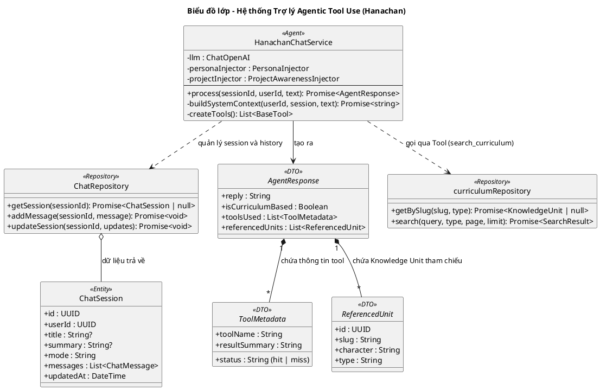

# Biểu đồ lớp: Trợ lý học tập (Hanachan - Agentic Tool Use)

Biểu đồ này mô tả hệ thống Trợ lý Hanachan dưới dạng một **Agentic Model**, sử dụng khả năng suy luận của LLM để tự quyết định việc sử dụng công cụ (Tool Use) và cung cấp phản hồi có ý thức về giáo trình (Curriculum Awareness).

### Các tính năng cốt lõi:

*   **Tra cứu tri thức đa phương diện**: Tra cứu thông tin chi tiết về Kanji, từ vựng, ngữ pháp trực tiếp từ giáo trình hệ thống (Level 1-60).
*   **Nhận diện thực thể tự động (Entity Linking)**: Tự động nhận diện các từ vựng, hán tự xuất hiện trong nội dung trò chuyện.
*   **Mở nhanh thẻ thông tin (QuickView)**: Cho phép mở nhanh thẻ thông tin chi tiết ngay trong giao diện chat để xem nghĩa, cách đọc và ví dụ.
*   **Quản lý ngữ cảnh thông minh (Smart Context)**:
    *   Sử dụng **Session Summary** làm "trạng thái làm việc" (Working State) để ghi nhớ các mục tiêu và quyết định kỹ thuật đã chốt.
    *   Tự động cập nhật tiêu đề và tóm tắt phiên chat dựa trên diễn biến hội thoại (Implicit Metadata Updates).
    *   Tối ưu hóa lịch sử hội thoại, tập trung vào 6 tin nhắn gần nhất để đảm bảo độ chính xác và nhạy bén.

### Đặc điểm thiết kế Agentic mới:
1.  **Reasoning-First Tool Calling**: Hanachan không còn sử dụng bộ lọc Regex cứng nhắc. AI được cung cấp công cụ `search_curriculum` và tự suy luận (Inner Monologue) xem câu hỏi của người dùng có thực sự cần tra cứu cơ sở dữ liệu học tập hay không.
2.  **Proactive Search (Tra cứu chủ động)**: AI thực hiện luồng ReAct (Reasoning + Acting). Ngay cả khi người dùng không yêu cầu trực tiếp, nếu AI nhận thấy việc tra cứu giúp câu trả lời chính xác hoặc đồng bộ với giáo trình hơn, AI sẽ **tự thực hiện tra cứu** trước khi trả lời.
3.  **Curriculum Awareness (Ý thức giáo trình)**: 
    - Nếu AI tra cứu thành công: Phản hồi dựa trên dữ liệu chuẩn của hệ thống (Mnemonic, Example).
    - Nếu AI không tra cứu được hoặc không thấy trong DB: AI vẫn trả lời dựa trên kiến thức chung nhưng **bắt buộc** kèm theo thông báo: *"Thông tin này nằm ngoài giáo trình chính thức của Hanachan"*.
4.  **Precise CTA Generation**: Các nút học bài (CTA) được tạo ra trực tiếp từ ID của các đơn vị tri thức tìm thấy trong Tool Call, đảm bảo tính chính xác tuyệt đối và dữ liệu không bao giờ bị sai lệch.
5.  **Transparent Execution (Minh bạch)**: Trạng thái tra cứu (`hit` hoặc `miss`) được trả về UI để người dùng phân biệt được đâu là kiến thức chuẩn hóa, đâu là kiến thức bổ trợ từ AI.
6.  **Session Context Management (Super-Dev-Pro)**:
    - **Session Summary**: Hệ thống duy trì một "bản tóm tắt trạng thái làm việc" (Working State) thay vì chỉ tóm tắt nội dung. Đây là nơi lưu trữ các mục tiêu, quyết định kỹ thuật đã chốt và các câu hỏi còn mở.
    - **Limited History**: Chỉ 6 tin nhắn gần nhất được gửi kèm System Message (chứa Summary) để tối ưu hóa context window và tránh nhiễu thông tin cũ.
    - **Implicit Metadata Updates**: AI tự động nhận diện các thời điểm quan trọng (chốt phương án, chuyển mục tiêu) để cập nhật ngầm `summary` và `title` của phiên chat qua các tag `[[SUMMARY_UPDATE]]` và `[[TITLE_UPDATE]]`.

