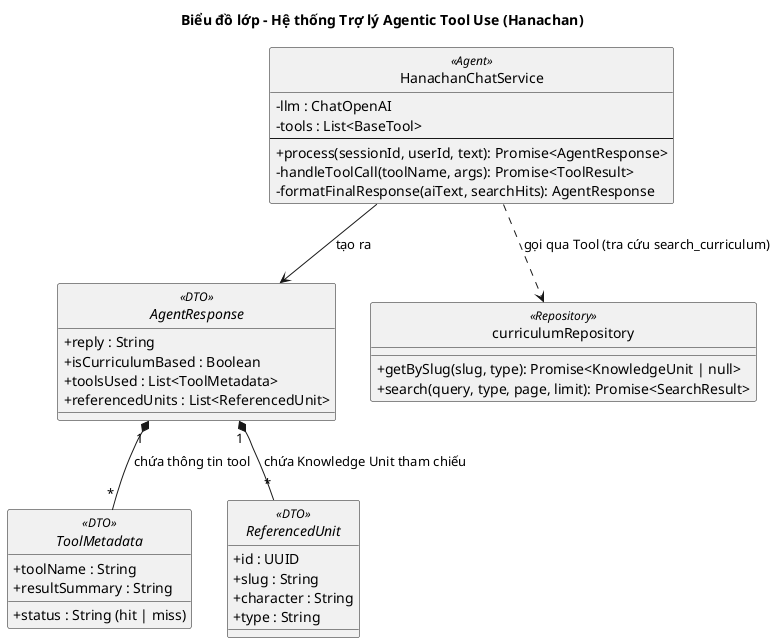

# Biểu đồ lớp: Trợ lý học tập (Hanachan - Agentic Tool Use)

Biểu đồ này mô tả hệ thống Trợ lý Hanachan dưới dạng một **Agentic Model**, sử dụng khả năng suy luận của LLM để tự quyết định việc sử dụng công cụ (Tool Use) và cung cấp phản hồi có ý thức về giáo trình (Curriculum Awareness).

### Đặc điểm thiết kế Agentic mới:
1.  **Reasoning-First Tool Calling**: Hanachan không còn sử dụng bộ lọc Regex cứng nhắc. AI được cung cấp công cụ `search_curriculum` và tự suy luận (Inner Monologue) xem câu hỏi của người dùng có thực sự cần tra cứu cơ sở dữ liệu học tập hay không.
2.  **Proactive Search (Tra cứu chủ động)**: AI thực hiện luồng ReAct (Reasoning + Acting). Ngay cả khi người dùng không yêu cầu trực tiếp, nếu AI nhận thấy việc tra cứu giúp câu trả lời chính xác hoặc đồng bộ với giáo trình hơn, AI sẽ **tự thực hiện tra cứu** trước khi trả lời.
3.  **Curriculum Awareness (Ý thức giáo trình)**: 
    - Nếu AI tra cứu thành công: Phản hồi dựa trên dữ liệu chuẩn của hệ thống (Mnemonic, Example).
    - Nếu AI không tra cứu được hoặc không thấy trong DB: AI vẫn trả lời dựa trên kiến thức chung nhưng **bắt buộc** kèm theo thông báo: *"Thông tin này nằm ngoài giáo trình chính thức của Hanachan"*.
4.  **Precise CTA Generation**: Các nút học bài (CTA) được tạo ra trực tiếp từ ID của các đơn vị tri thức tìm thấy trong Tool Call, đảm bảo tính chính xác tuyệt đối và dữ liệu không bao giờ bị sai lệch.
5.  **Transparent Execution (Minh bạch)**: Trạng thái tra cứu (`hit` hoặc `miss`) được trả về UI để người dùng phân biệt được đâu là kiến thức chuẩn hóa, đâu là kiến thức bổ trợ từ AI.

