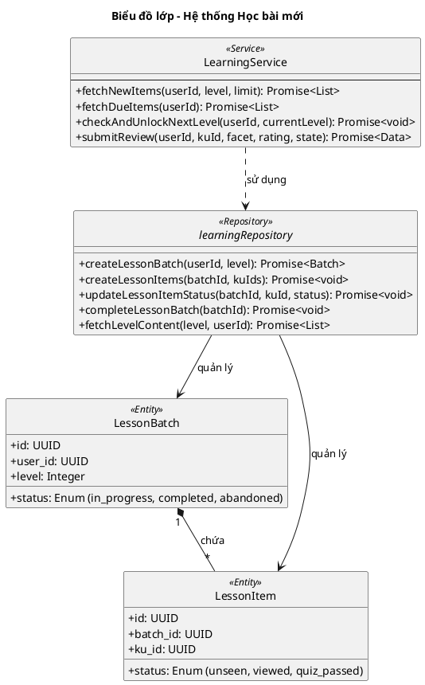

# Biểu đồ lớp: Hệ thống Học bài mới (Learning System)

Biểu đồ này tập trung vào logic của **Trình quản lý bài học (Learning Service)**, chịu trách nhiệm cho quy trình học từ mới theo đợt (batch) và quy hoạch lộ trình học tập.

### Các thành phần chính:
1. **LearningService**: "Bộ não" của tầng chức năng, điều phối việc lấy dữ liệu và kiểm tra quy tắc mở khóa Level mới (90% Mastery Rule).
2. **90% Mastery Rule**: Quy tắc nghiệp vụ kiểm tra nếu 90% nội dung Level hiện tại đạt trạng thái 'Review' trở lên thì tự động thăng cấp cho User.
3. **LessonBatch/Item**: Đảm bảo tính **Bền vững (Persistence)**. Người dùng có thể dừng học giữa chừng và quay lại đúng vị trí đang học nhờ vào việc lưu trạng thái từng item vào DB. Trạng thái `abandoned` được dùng khi người dùng hủy bỏ lô học.
