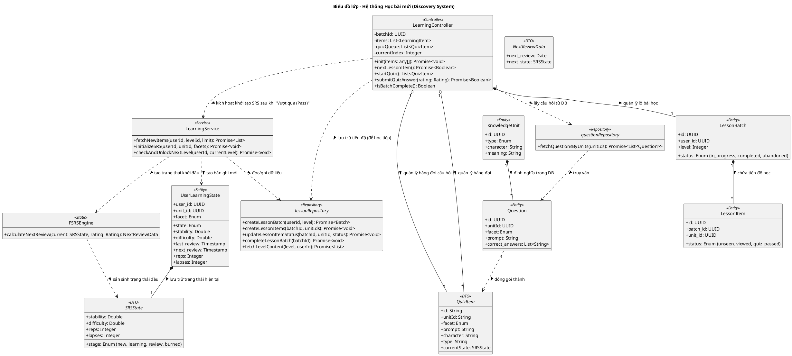

# Biểu đồ lớp: Hệ thống Học bài mới (Learning System)

Biểu đồ này tập trung vào logic của **Trình quản lý bài học (Learning Service)**, chịu trách nhiệm cho quy trình học từ mới theo đợt (batch) và quy hoạch lộ trình học tập.

### Các quy tắc nghiệp vụ đặc thù của Learning:
1. **Batch Persistence**: Trạng thái học tập được lưu vào `LessonBatch` và `LessonItem`. Nếu người dùng thoát giữa chừng, họ có thể quay lại đúng slide hoặc câu hỏi đang làm dở (Resume).
2. **Onboarding-Triggered SRS**: Khác với Review, Learning chỉ khởi tạo trạng thái FSRS cho một Knowledge Unit khi nó đạt trạng thái `quiz_passed` (trả lời đúng tất cả các facet trong bài test cuối đợt học). Điều này đánh dấu việc kiến thức chính thức **bước vào** chu trình SRS với trạng thái khởi điểm (Stability ~4h).
3. **Strict DB-Driven Questions**: Không còn việc tự sinh câu hỏi (no gen quiz). Mọi câu hỏi (như hỏi Nghĩa, hỏi Cách đọc) đều phải có bản ghi tương ứng trong bảng `questions`. `LearningController` sẽ tải toàn bộ câu hỏi liên quan từ `questionRepository`.
4. **90% Knowledge Rule**: `LearningService` kiểm tra điều kiện thăng cấp sau khi mỗi Batch hoàn thành (Complete).
5. **No FIF in Learning**: Quy trình Discovery không áp dụng kiến trúc FIF. Việc người dùng sai bao nhiêu lần trong bài kiểm tra (Quiz) không ảnh hưởng đến trạng thái khởi tạo của SRS. Mọi Knowledge Unit sau khi Pass đều bắt đầu với cùng một chỉ số Stability nền tảng (măc định ~4h).

### Các thành phần chính:
1. **LearningService**: "Bộ não" của tầng chức năng, điều phối việc lấy dữ liệu và kiểm tra quy tắc mở khóa Level mới (90% Knowledge Rule).
2. **90% Knowledge Rule**: Quy tắc nghiệp vụ kiểm tra nếu 90% nội dung Level hiện tại đạt trạng thái 'Review' trở lên thì tự động thăng cấp cho User.
3. **LessonBatch/Item**: Đảm bảo tính **Bền vững (Persistence)**. Người dùng có thể dừng học giữa chừng và quay lại đúng vị trí đang học nhờ vào việc lưu trạng thái từng item vào DB. Trạng thái `abandoned` được dùng khi người dùng hủy bỏ lô học.
