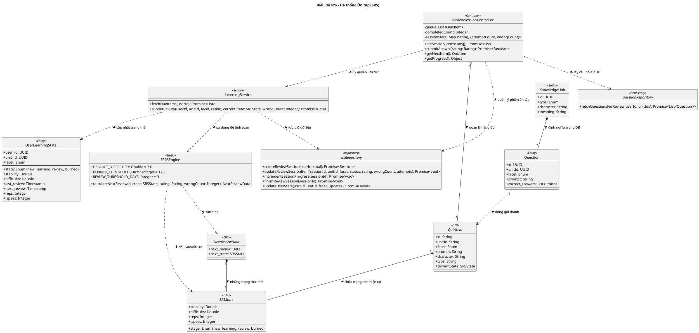

# Biểu đồ lớp: Hệ thống Ôn tập (Review System)

Biểu đồ này mô tả cơ chế cốt lõi của Hanachan: Thuật toán FSRS và Trình điều khiển phiên ôn tập, thể hiện mối liên kết chặt chẽ giữa logic điều khiển, nghiệp vụ và thực thể dữ liệu.

### Các quy tắc nghiệp vụ quan trọng:
1. **Dòng dữ liệu (Data Flow)**: `ReviewSessionController` quản lý hàng chờ các `QuizItem`. Khi người dùng trả lời, nó gọi `LearningService` để xử lý.
2. **FIF Architecture**: Thay vì `firstAttemptDone`, controller theo dõi `wrongCount` cho từng item.
3. **Commit on Success**: Chỉ khi trả lời đúng thì mới gọi `submitReview`. Lúc mình `wrongCount` được gửi kèm để tính toán hình phạt (Intensity).
4. **No Gen Quiz**: Hệ thống không tự sinh câu hỏi. Mọi khía cạnh (facet) cần ôn tập đều phải được định nghĩa sẵn là một bản ghi trong bảng `questions`.
5. **Stability Guard**: Đảm bảo $S_{new} \ge S_{prev}$ khi người dùng trả lời đúng, bất kể cường độ lỗi sai là bao nhiêu (không làm người dùng bị "văng ngược" quá xa).
6. **Min Stability Floor**: Luôn giữ sàn 0.1 ngày (~2.4h) cho các thẻ sai, đảm bảo người dùng ôn lại ngay trong phiên sau của cùng một ngày.
