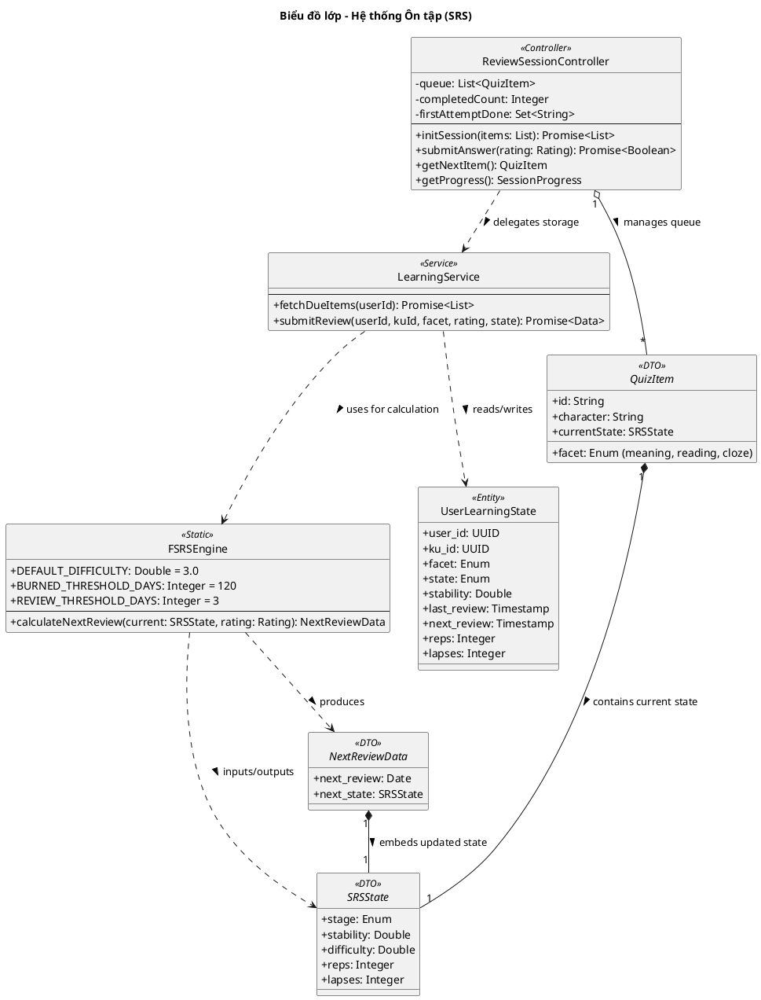

# Biểu đồ lớp: Hệ thống Ôn tập (Review System)

Biểu đồ này mô tả cơ chế cốt lõi của Hanachan: Thuật toán FSRS và Trình điều khiển phiên ôn tập, thể hiện mối liên kết chặt chẽ giữa logic điều khiển, nghiệp vụ và thực thể dữ liệu.

### Các quy tắc nghiệp vụ quan trọng:
1. **Dòng dữ liệu (Data Flow)**: `ReviewSessionController` quản lý hàng chờ các `QuizItem`. Khi người dùng trả lời, nó gọi `LearningService` để xử lý. `LearningService` lấy `UserLearningState` hiện tại, đưa qua `FSRSEngine` để nhận `NextReviewData`, sau đó lưu lại vào DB.
2. **Independence Law**: Mỗi `UserLearningState` được xác định duy nhất bởi bộ ba `(user_id, ku_id, facet)`.
3. **Atomic Update**: Mọi thay đổi về trạng thái SRS được thực hiện ngay lập tức sau câu trả lời đầu tiên để đảm bảo tính toàn vẹn dữ liệu.
4. **Zero-Reveal Rule**: Không hiển thị đáp án đúng khi trả lời sai (re-queue), đảm bảo trải nghiệm học tập tập trung vào việc thu hồi trí nhớ (active recall).
