# Core Class Design - Hanachan v2 (Production Spec)

This document defines the high-level class architecture to support the complex business flows of the Hanachan platform, including the FSRS algorithm, facetted review logic, and curriculum progression rules.

```plantuml
@startuml
skinparam packageStyle rectangle
skinparam classAttributeIconSize 0
hide circle

' ==========================================
' 1. THE BRAIN: FSRSEngine (Logic Engine)
' ==========================================
class FSRSEngine <<Static>> {
  + DEFAULT_DIFFICULTY : Double = 3.0
  + BURNED_THRESHOLD_DAYS : Integer = 120
  + REVIEW_THRESHOLD_DAYS : Integer = 3
  --
  + calculateNextReview(current: SRSState, rating: Rating) : NextReviewData
}

' ==========================================
' 2a. THE DISCOVERY: LearningController
' ==========================================
class LearningController <<Controller>> {
  - batchId : UUID
  - quizQueue : List<QuizItem>
  --
  + init(items: List) : Promise<void>
  + startQuiz() : List<QuizItem>
  + submitQuizAnswer(rating: Rating) : Promise<Boolean>
}

' ==========================================
' 2b. THE REVIEWER: ReviewSessionController
' ==========================================
class ReviewSessionController <<Controller>> {
  - queue : List<QuizItem>
  --
  + initSession(items: List) : Promise<List>
  + submitAnswer(rating: Rating) : Promise<Boolean>
  + getNextItem() : QuizItem
}

' ==========================================
' 3. THE SERVICE: LearningService
' ==========================================
class LearningService <<Service>> {
  --
  + fetchNewItems(userId, level, limit) : Promise<List>
  + fetchDueItems(userId) : Promise<List>
  + checkAndUnlockNextLevel(userId, currentLevel) : Promise<void>
  + submitReview(userId, unitId, facet, rating, state) : Promise<Data>
}

' ==========================================
' 4. THE ENTITY: KnowledgeUnit (Data Model)
' ==========================================
interface KnowledgeUnit {
  + id : UUID
  + type : Enum (radical, kanji, vocabulary, grammar)
  + level : Integer
  + character : String
  + meaning : String
}

' ==========================================
' 5. THE ASSISTANT: HanachanChatService (Agentic)
' ==========================================
class HanachanChatService <<Agent>> {
  --
  + process(sessionId, userId, text) : Promise<AgentResponse>
  - detectEntity(text) : List<ReferencedUnit>
}

' ==========================================
' 6. THE ANALYST: AnalyticsService
' ==========================================
class AnalyticsService <<Service>> {
  --
  + logReview(isNew, isCorrect, userId) : Promise<void>
  + getDashboardStats(userId) : Promise<DashboardStats>
}

' ==========================================
' 7. THE CONTENT: Question & Repo
' ==========================================
interface Question {
  + id : UUID
  + ku_id : UUID
  + facet : String
  + prompt : String
}

class questionRepository <<Repository>> {
  + fetchAllQuestionsForUnits(unitIds) : Promise<List>
  + fetchQuestionsBatch(items) : Promise<List>
}

class lessonRepository <<Repository>> {
  + createLessonBatch(userId, level)
  + updateLessonItemStatus(batchId, unitId, status)
}

class srsRepository <<Repository>> {
  + updateUserState(userId, unitId, facet, updates)
  + createReviewSession(userId, total)
}

class curriculumRepository <<Repository>> {
  + getBySlug(slug, type)
  + searchCurriculum(keyword)
}

' RELATIONSHIPS
ReviewSessionController ..> LearningService : calls submitReview (Atomic)
LearningController ..> LearningService : calls initializeSRS (Deferred)
LearningService --> FSRSEngine : uses
LearningService ..> AnalyticsService : logs events
ReviewSessionController --> KnowledgeUnit : manages
LearningController --> KnowledgeUnit : manages
LearningController --> questionRepository : fetches questions
ReviewSessionController --> questionRepository : fetches questions
LearningController ..> lessonRepository : persists progress
ReviewSessionController ..> srsRepository : manages sessions
LearningService ..> srsRepository : updates SRS state
LearningService ..> lessonRepository : fetches content
HanachanChatService ..> curriculumRepository : searches curriculum
KnowledgeUnit "1" *-- "*" Question : defined by
@enduml
```

## Detailed Responsibility Breakdown

### 1. `FSRSEngine`
- **Location**: `src/features/learning/domain/FSRSEngine.ts`
- **Responsibility**: Pure mathematical implementation of the Free Spaced Repetition Scheduler.
- **Logic**: 
    - **Pass**: Stability growth = `1.5x` (Good) adjusted by difficulty.
    - **Fail**: Stability penalty = `0.4x`.
    - **Stages**: `learning` (< 3 days), `review` (3-120 days), `burned` (> 120 days).
    - **Stability Guard**: Ensures success never schedules an item earlier than its current stability.

### 2a. `LearningController` (New)
- **Location**: `src/features/learning/LearningController.ts`
- **Responsibility**: Orchestrates the **Discovery Flow** (Learning new items).
- **Batch Persistence**: Manages `LessonBatch` and `LessonItem` to allow users to pause and resume lessons.
- **Deferred SRS Initialization**: Unlike Review, this controller **DOES NOT** update SRS state during the quiz. It only triggers `initializeSRS` (Stability ~4h) once the user has successfully **passed all facets** of a Knowledge Unit in the quiz phase.

### 2b. `ReviewSessionController`
- **Location**: `src/features/learning/ReviewSessionController.ts`
- **Responsibility**: Orchestrates the **Review Flow** (Spaced Repetition).
- **FIF Architecture**: Implements the Failure Intensity Framework to solve "Ease Hell".
- **Accumulated Penalty**: Tracks `wrongCount` (struggle) within a session.
- **Commit on Success**: Calculates and applies the FSRS update ONLY when the item is answered correctly, using the `wrongCount` to determine the penalty level.
- **Independence Law**: Updates specific facets (Meaning, Reading) independently to isolate struggle.

### 3. `LearningService`
- **Location**: `src/features/learning/service.ts`
- **Responsibility**: Orchestrates database operations and business rule validation.
- **Repository Usage**:
    - Uses `srsRepository` for updating Spaced Repetition states.
    - Uses `lessonRepository` for fetching level content and curriculum progress.
- **90% Knowledge Rule**: Implements level unlocking logic. Checks if 90% of current level items (Knowledge Units) have reached `review` or `burned` stage across all facets before advancing the user.

### 4. `lessonRepository` (New)
- **Location**: `src/features/learning/lessonRepository.ts`
- **Responsibility**: Persistence for the Discovery Flow. Manages `lesson_batches` and `lesson_items`.

### 5. `srsRepository` (New)
- **Location**: `src/features/learning/srsRepository.ts`
- **Responsibility**: Core SRS and Review Session persistence. Manages `user_learning_states`, `review_sessions`, and `user_learning_logs`.

### 6. `HanachanChatService`
- **Location**: `src/features/chat/advanced-chatbot.ts`
- **Responsibility**: Agentic AI Assistant (Tool Use Model).
- **Role**: Uses LLM-driven reasoning to decide when to call the `search_curriculum` tool. Prioritizes internal database content for explanations. Automatically adds curriculum-aware notices for out-of-scope knowledge. Generates precise CTA metadata from tool results to ensure 100% data consistency.

### 7. `AnalyticsService`
- **Location**: `src/features/analytics/service.ts`
- **Responsibility**: Data aggregation for the dashboard.
- **Role**: Calculates precision, retention, and heatmap data from `user_learning_logs`.
