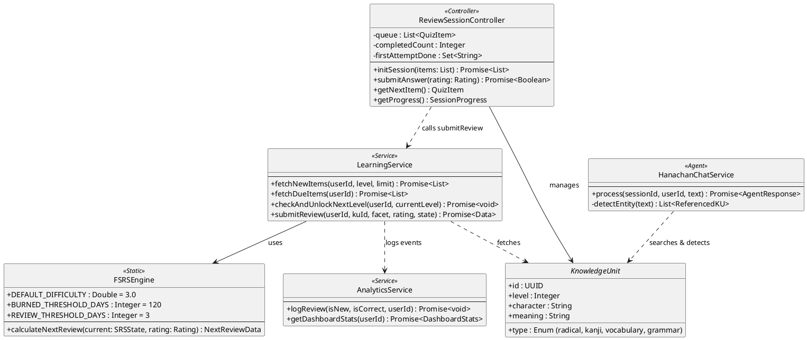

# Core Class Design - Hanachan v2 (Production Spec)

This document defines the high-level class architecture to support the complex business flows of the Hanachan platform, including the FSRS algorithm, facetted review logic, and curriculum progression rules.

## Detailed Responsibility Breakdown

### 1. `FSRSEngine`
- **Location**: `src/features/learning/domain/FSRSEngine.ts`
- **Responsibility**: Pure mathematical implementation of the Free Spaced Repetition Scheduler.
- **Logic**: 
    - **Pass**: Stability growth = `1.5x` (Good) adjusted by difficulty.
    - **Fail**: Stability penalty = `0.4x`.
    - **Stages**: `learning` (< 3 days), `review` (3-120 days), `burned` (> 120 days).
    - **Stability Guard**: Ensures success never schedules an item earlier than its current stability.

### 2. `ReviewSessionController`
- **Location**: `src/features/learning/ReviewSessionController.ts`
- **Responsibility**: State machine for the active session UI.
- **Independence Law**: Manages `firstAttemptDone` to ensure only the first attempt on a facet updates the long-term FSRS state.
- **Correction Loop**: Re-queues incorrect items to the end of the `queue` until they are answered correctly.
- **Zero-Reveal Rule**: Does not show the correct answer upon failure, forcing re-attempt.

### 3. `LearningService`
- **Location**: `src/features/learning/service.ts`
- **Responsibility**: Orchestrates database operations and business rule validation.
- **90% Knowledge Rule**: Implements level unlocking logic. Checks if 90% of current level items (KUs) have reached `review` or `burned` stage across all facets before advancing the user.

### 4. `HanachanChatService`
- **Location**: `src/features/chat/advanced-chatbot.ts`
- **Responsibility**: Heuristic-driven Agentic Assistant.
- **Role**: Determines intent via message keywords (Regex-based routing for efficiency). Integrates directly with repository for KU detection in responses. Provides context-aware explanations using RAG logic.

### 5. `AnalyticsService`
- **Location**: `src/features/analytics/service.ts`
- **Responsibility**: Data aggregation for the dashboard.
- **Role**: Calculates precision, retention, and heatmap data from `user_learning_logs`.
