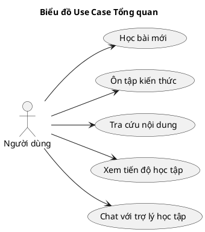

# Biểu đồ Use Case Tổng quan (Master Use Case Diagram)

Biểu đồ dưới đây mô tả các tương tác chính của Người dùng với hệ thống Hanachan v2.

## Giải thích các Use Case

1.  **Học bài mới**: Tham gia vào các đợt học (batch) gồm 5 từ mới, thực hiện xem nội dung tri thức và làm bài kiểm tra xác thực (Mastery Quiz).
2.  **Ôn tập kiến thức**: Thực hiện ôn luyện các mục đã học theo lịch được thuật toán FSRS tính toán tự động.
3.  **Tra cứu nội dung**: Tìm kiếm, lọc và xem thông tin chi tiết về Kanji, Bộ thủ, Từ vựng và Ngữ pháp.
4.  **Xem tiến độ học tập**: Theo dõi biểu đồ nhiệt (heatmap), tỷ lệ ghi nhớ và trạng thái thăng cấp (Leveling) cá nhân.
5.  **Chat với trợ lý học tập**: Tương tác với Hanachan AI để hỏi đáp kiến thức hoặc nhận giải thích chuyên sâu về Kanji, Từ vựng, Ngữ pháp.
